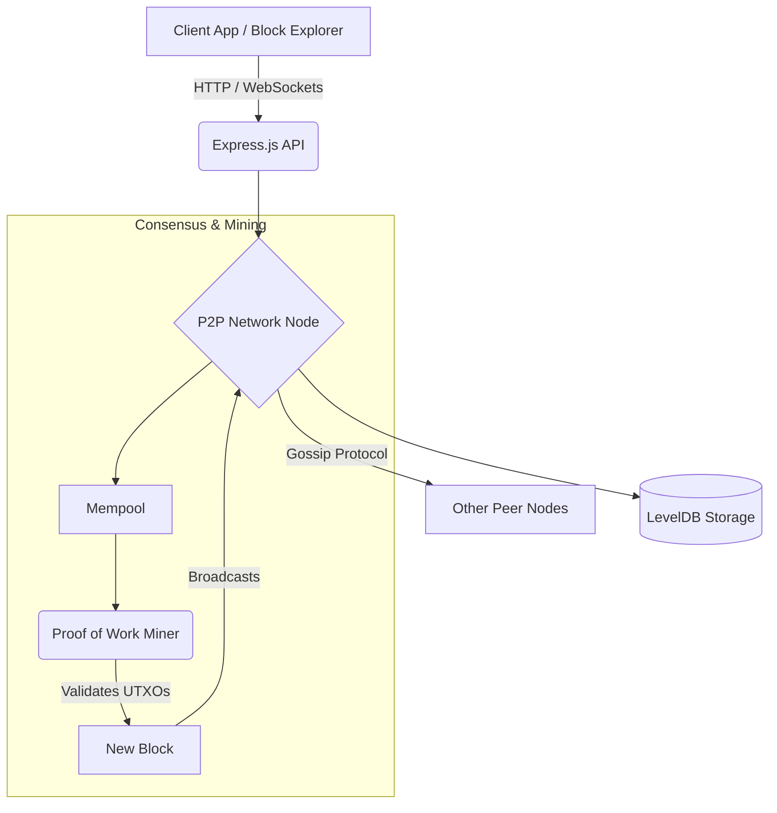

# 🚀 BlockJS

[](https://github.com/vikramkrishna1705-beep/BlockJS/actions/workflows/test.yml)
[](https://jestjs.io/)
[](https://www.docker.com/)
[](https://opensource.org/licenses/MIT)

**BlockJS** is a production-grade, pedagogical blockchain framework written from scratch in JavaScript. It was built to demonstrate a deep understanding of distributed systems, cryptography, and modern backend engineering principles.

Unlike typical simple blockchain tutorials, BlockJS implements real-world, industry-standard mechanisms including a **true UTXO model**, **Dynamic Difficulty Adjustment (DDA)**, **Elliptic Curve Cryptography (ECDSA)**, and **persistent LevelDB storage**.

---

## ✨ Core Features

* 🔐 **Elliptic Curve Cryptography**: Uses `secp256k1` (the same curve used by Bitcoin) for generating wallet key pairs and digitally signing transactions.
* 💸 **True UTXO Financial Model**: Eschews the simplistic account-balance model for an Unspent Transaction Output (UTXO) pool. Transactions rigorously validate inputs against cryptographic signatures and available funds.
* ⛏️ **Proof-of-Work & DDA**: Features a dynamic PoW consensus algorithm that automatically scales mining difficulty up or down to ensure a consistent, predictable block generation rate.
* 🌐 **P2P WebSocket Network**: Implements a robust Socket.io peer-to-peer network for broadcasting transactions, syncing chains, and resolving mempool conflicts in real-time.
* 💾 **LevelDB Persistence**: The ledger and UTXO states are persistently saved to disk, ensuring data survives node restarts and crashes.
* 🐳 **Docker Swarm / Compose**: Fully containerized environment capable of effortlessly spinning up an interconnected 3-node cluster to simulate a decentralized network out-of-the-box.
* 🌳 **Merkle Trees**: Cryptographically aggregates transaction hashes into a single root hash within block headers, allowing for efficient verification and SPV (Simplified Payment Verification) capabilities.
* 📊 **Visual Block Explorer**: A built-in, lightweight web dashboard to monitor the blockchain state, mempool, and node data in real-time.
* 🧪 **Comprehensive Test Coverage**: Features a robust Jest testing suite ensuring data immutability, state transitions, and cryptographic integrity.

---

## 🏗️ Architecture



- **`src/blockchain`**: Manages block generation, PoW hashing (`SHA-256`), chain validation, and consensus rules.
- **`src/wallet`**: Handles key pairs, transaction signing, and the UTXO state machine.
- **`src/network`**: Express HTTP API for client interactions and Socket.io server for inter-node communication.
- **`src/utils`**: Configs, cryptographic wrappers, and LevelDB database adapters.

---

## 🚀 Quick Start

### 🐳 Option 1: Docker (Recommended)
Spin up a fully connected 3-node cluster instantly using Docker Compose.

```bash
docker-compose up --build
```
* **Node 1**: `http://localhost:3001` (Genesis Node)
* **Node 2**: `http://localhost:3002`
* **Node 3**: `http://localhost:3003`

### 💻 Option 2: Local Node.js
Requires Node.js 18+.

```bash
# Install dependencies
npm install

# Start the first node
npm start

# In a separate terminal, start a second node connected to the first
HTTP_PORT=3001 PEERS=ws://localhost:3000 npm start
```

---

## 🎮 Interacting with the Network

Once your nodes are running, you can use the built-in visual explorer or `cURL`/Postman to interact with the HTTP APIs.

**1. Visual Block Explorer**
Open your browser and navigate to:
```
http://localhost:3001
```
*(If you are running the single local node on port 3000, go to `http://localhost:3000`)*

**2. View the Blockchain (API)**
```bash
curl http://localhost:3001/blocks
```

**3. Create a Transaction**
```bash
curl -X POST -H "Content-Type: application/json" -d '{
  "outputPublicKey": "recipient-public-key-here",
  "amount": 50,
  "fee": 1
}' http://localhost:3001/transact
```

**4. Mine a Block (Processes Mempool & Awards Coinbase)**
```bash
curl http://localhost:3002/mine
```

---

## 🧪 Testing
The framework is rigorously tested using Jest. The test suite covers cryptographic signature verification, malicious chain rejections, and difficulty adjustment bounds.

```bash
npm run test
```

---

## 💡 Why BlockJS? (For Interviewers)
If you're reviewing this repository, you might wonder why I built this instead of a standard CRUD application. 

I engineered BlockJS because building a blockchain from scratch forces a developer to confront complex, low-level computer science problems:
1. **Concurrency & State Management**: Handling simultaneous P2P events, mempool synchronization, and UTXO state derivation without race conditions.
2. **Applied Cryptography**: Moving beyond standard JWTs to utilize raw elliptic curve signatures and hashing algorithms for trustless verification.
3. **Decentralized Consensus**: Designing an architecture where nodes must independently agree on the "truth" without a central authority or database.
4. **Data Structures**: Implementing cryptographically linked lists and immutable ledgers.

BlockJS demonstrates my ability to design complex distributed architectures, write test-driven clean code, and tackle challenges outside the typical web development scope.